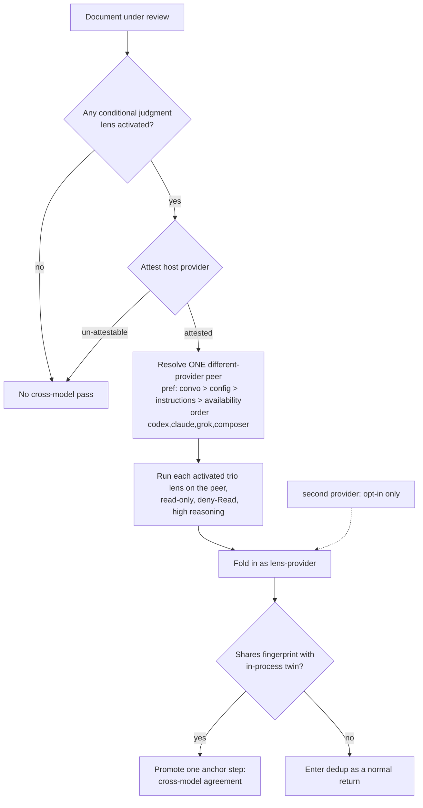

# Cross-Model Adversarial Review for ce-doc-review - Plan

## Goal Capsule

- **Objective:** Give ce-doc-review a cross-model pass that runs the conditional judgment lenses through **one different model provider than the host** (auto-chosen from what's available, overridable), so a better-quality review is not biased by the single model of the current harness — a different-provider peer covers the host model's blind spots and its agreement promotes findings a single model would miss. A second provider is explicit opt-in, not the default.
- **Product authority:** Repo maintainer (product decisions confirmed in brainstorm; the generalization from a fixed single peer to attested-provider auto-selection with override is a maintainer-directed enrichment, refined by a cross-model design review from codex + grok).
- **Execution profile:** Standard, software, scoped to **ce-doc-review only** — `ce-code-review` and (later) `ce-simplify-code` adopting a shared contract are explicit follow-ups. Additive to an existing skill: a provider-selection + route-adapter script and wiring edits. No converter or parser changes.
- **Open blockers:** None.
- **Product Contract preservation:** Changed — **R7** (peer selection) generalized from a fixed host→peer map (Claude/Cursor→codex, Codex→claude) to **attest-host-provider-and-exclude + resolve one different-provider peer** (preference precedence + availability order), per maintainer direction. Added **R14–R19** (provider/route model, one-peer default + preference resolution + second-provider opt-in, attest-or-skip + explicit degradation, per-route read-only/high-reasoning recipe, generalized reviewer naming + non-apply fold-in, egress allowlist). All other product R-IDs preserved.

---

## Product Contract

### Summary

Add a cross-model pass to ce-doc-review: whichever of the conditional judgment trio — `adversarial-document-reviewer`, `product-lens-reviewer`, `security-lens-reviewer` — activated for a document also runs on **one different model provider than the host** (auto-chosen from what's available, overridable via conversation/config/project-instructions; a second provider opt-in) in a read-only, least-privilege process, folding in as `<reviewer-name>-<provider>` where agreement with its in-process twin promotes the finding by one anchor step (never auto-applied). The peer runs the provider's strong model at high reasoning across all activated lenses, in both interactive and headless modes. Alongside those focused trio twins, one **whole-document sweep** has a single different-provider peer review the entire document (general reviewer, not lens-scoped) so a different model catches blind spots across every section, not just the trio — broad coverage for one extra call rather than a per-lens fan-out (KTD6 / R20 / U9).

### Problem Frame

ce-doc-review's judgment lenses run on a single model, so their blind spots are the host model's blind spots — a premise it won't question, a threat class it doesn't know, a strategic claim it won't challenge. ce-code-review already closes this gap for its adversarial lens by running a second, different-family model and treating cross-model agreement as its strongest promotion signal. Running the same review through another model manually on documents has reliably surfaced issues the single-model pass missed — the same motivation, confirmed in practice. ce-doc-review differs from code-review in one way that shapes the port: its value is spread across several judgment lenses rather than concentrated in one, so a faithful adversarial-only mirror would leave most of the cross-model upside unclaimed.

### Key Decisions

- **Mirror code-review's mechanism, not only its idea.** Reuse the proven shape — same persona brief handed to the peer, same findings schema, fold-in as a distinct `<reviewer-name>-<peer>` reviewer, read-only peer, non-blocking self-bounding execution. ce-doc-review gets its own script (skills are self-contained units), but the design is the established one, not a new invention.
- **Trio, not adversarial-only.** The cross-model pass covers the three conditional judgment lenses (`adversarial`, `product-lens`, `security-lens`) — the lenses whose output diverges most across model families, where agreement therefore carries real signal. The convergent lenses gain little from a second opinion.
- **feasibility excluded to preserve the conditional cost profile.** `feasibility-reviewer` is judgment-heavy but always-on; including it would spawn the peer on every single review. Excluding it keeps the pass targeted to documents that activate a conditional judgment lens.
- **Peer runs the provider's strong model at high reasoning across all lenses.** *(Revised from the original per-lens `sol`/`terra` tiering, which the maintainer replaced.)* The chosen different-provider peer runs every activated lens on one designated model at high reasoning — codex `gpt-5.6-sol`, claude `opus`, grok `grok-4.5`, composer `composer-2.5-fast` (composer's `-fast` tier is its ceiling). One strong independent model at high reasoning is the lever; the earlier knowledge-vs-reasoning per-lens split is superseded.
- **Model identity is a principle, not a pin.** A cross-model pass inherently names a concrete different family (code-review's script already pins one), but concrete IDs go stale. The contract is the tier + reasoning level; the concrete IDs below are the current instance and a documented maintenance point.

### Requirements

**Scope and activation**

- R1. The cross-model pass covers the conditional judgment trio — `adversarial-document-reviewer`, `product-lens-reviewer`, `security-lens-reviewer` — running each activated member through a different model family in a separate read-only process.
- R2. A trio member runs cross-model only when it is activated for the document under ce-doc-review's existing persona-activation logic. No new activation triggers are introduced, so a routine document that activates no trio member gets no cross-model pass.
- R3. `feasibility-reviewer`, `coherence-reviewer`, `scope-guardian-reviewer`, and `design-lens-reviewer` do not run cross-model.

**Peer model tiering**

- R4. All activated trio lenses run on the selected peer's **single provider model at high reasoning** — one model per provider, not a per-lens split. Current mapping: codex `gpt-5.6-sol` + `model_reasoning_effort=high`; claude `opus` + `--effort high`; grok `grok-4.5` + `--effort high` (or `cursor-agent grok-4.5-high`); composer `composer-2.5-fast` (composer has no higher reasoning tier — its `-fast` tier is the ceiling, an accepted exception to the "high reasoning" default). (This supersedes the earlier per-lens `sol`/`terra`, flagship-vs-mid tiering, which the maintainer replaced with a strong-model-at-high-reasoning peer.)
- R5. *(Superseded by R4.)* The earlier `adversarial`/`product-lens` → mid-capability + high-reasoning split is folded into R4's one-model-per-provider-at-high rule.
- R6. Peer model and reasoning are a provider-model-plus-high-reasoning principle. The concrete IDs in R4 are the current instance and a single-edit maintenance point, not the contract; the reasoning-flag mechanism differs per CLI (see R17).

**Peer selection and fold-in**

- R7. The peer is chosen by attesting the host's own **provider** and excluding it (so the pass never self-reviews), then resolving **one** different-provider peer per the preference precedence and availability order in R15. An un-attestable host provider means the pass skips (R16), never a same-provider peer.
- R8. Each cross-model result folds into synthesis as reviewer `<reviewer-name>-<peer>`, entering dedup and promotion exactly like an in-process reviewer return.
- R9. A cross-model finding that shares a dedup fingerprint with its in-process twin (`<reviewer-name>`) promotes by one anchor step — the cross-model agreement signal.

**Execution and safety**

- R10. The peer runs strictly read-only and cannot mutate the repository (read-only sandbox for codex — reads allowed, writes/network blocked; denied mutators, MCP writes, and subagents for claude). See R17 for the isolation tiers (truly tool-less vs. read-only residual).
- R11. The pass is non-blocking and self-bounding. Any failure — no peer, CLI missing or unauthenticated, timeout, or unparseable output — logs a reason and produces no fold-in. It never fails the review; a missing result is simply "no cross-model pass."
- R12. The pass runs in both interactive and headless modes. On an interactive host it announces prominently, naming the peer, that the judgment lenses are running cross-model, **and that full document content is sent to that peer provider** (third-party egress). In headless mode it emits no user-facing prose, but still emits a one-line audit log that document content was sent cross-model to the named peer provider.
- R13. The peer receives the document content plus the `document_type` and `origin` context slots the in-process persona adapts on, so its behavior matches the in-process reviewer rather than misfiring on a re-classification.

**Provider-family peer selection (generalization)**

- R14. A **provider family** is the serving model provider that must differ from the host to count as cross-model — OpenAI (codex), Anthropic (claude), xAI (grok), Cursor (composer). A **route** is how a provider is invoked: its dedicated CLI, or `cursor-agent --model <model>`. Independence is by *provider*, not CLI brand. Route table: codex → `codex` CLI only; claude → `claude` CLI only; grok → `grok` CLI primary, else `cursor-agent --model grok-4.5-high`; composer → `cursor-agent --model composer-2.5-fast` only. `cursor-agent` is used ONLY to reach grok (fallback) and composer — never for OpenAI/Anthropic (redundant with the common-harness CLIs and, via cursor-agent, a same-provider egress).
- R15. **Default: ONE cross-model peer**, resolved by this precedence — (1) a preference the user stated in conversation; (2) a `cross_model_peer:` key in `.compound-engineering/config.local.yaml`; (3) a preference already present in the agent's active project instructions (AGENTS.md/CLAUDE.md) — consumed from context, never read as a file; (4) default: the first **available** provider ≠ host by order `codex → claude → grok → composer`. A provider is available when any of its routes is installed, authenticated, and not rate-limited (grok = grok CLI OR `cursor-agent grok-4.5-high`). A **second** provider is explicit opt-in only (`CROSS_MODEL_MAX_PEERS`, default 1, clamped 0..2; config may not raise the hard cap); the default path is one peer, since one different-provider peer carries the proven signal and a second is a cost/egress multiplier, not a further bias reduction.
- R16. The host **provider** is attested by the **orchestrator/skill** (which knows its own harness: Claude Code → anthropic; Codex → openai; Cursor → its *active* serving provider) and passed to the script as an explicit `host_provider` argument — the script does not guess the host. Likewise the resolved peer preference (from conversation / config / project-instructions, which only the skill has in context) is resolved by the skill and passed in; the script owns availability probing and fallback, not context resolution. If the host provider cannot be attested — e.g. Cursor on an undetectable model — **or attestation confidence is below an explicit fail-closed threshold** (best-guess Composer-by-default is forbidden) — the pass **skips (zero peers)** rather than risk a same-provider peer. Missing/partial availability and non-firing are scored target behavior, never an error: the pass adds only the peer it can reach and never blocks the review (extends R11), and degrades explicitly (never a silent hard failure, never a same-provider peer).
- R17. The peer runs **read-only, headless, no permission prompt, at high reasoning, and TOOL-LESS** — least-privilege, since the peer reviews the document embedded in its prompt and needs no filesystem, web, MCP, or subagent tools. Deny every tool the route supports (not just Read), and run with the working dir set to the empty scratch run-dir (never the repo), so neither repo files nor network are an exfil path. Per-route recipe (model + high reasoning + read-only + no-tools + JSON): **codex** `exec -C <scratch> --skip-git-repo-check -s read-only -o OUT -m gpt-5.6-sol -c model_reasoning_effort="high"`; **claude** `-p --model opus --effort high --permission-mode dontAsk --bare --tools "" --max-turns 15 --no-session-persistence --json-schema S --output-format json` (run from empty scratch cwd); **grok** `-p --model grok-4.5 --effort high --permission-mode dontAsk --deny Edit --deny Write --deny Bash --deny Task --deny Read --deny 'mcp__*' --json-schema S --output-format json`; **grok-via-cursor-agent** `-p --model grok-4.5-high --mode ask --trust --output-format json`; **composer** `-p --model composer-2.5-fast --mode ask --trust --output-format json`. Reasoning-flag mechanics differ per harness: codex `-c model_reasoning_effort=`; claude/grok `--effort`; cursor-agent bakes it into the model id (`grok-4.5-high`); **composer has only its `-fast` tier — no high-reasoning option, an accepted exception**. **Route-isolation tiers + accepted read residual (DECIDED: accept).** The routes are two isolation tiers, not one: **truly tool-less** — claude (`--tools ""`, all built-ins disabled) and grok (`--deny Read` + `--disable-web-search`), where the peer has no read tool at all; and **read-only residual** — codex (`-s read-only`) and cursor-agent (`--mode ask`), which still permit *read* tools (codex additionally permits read-only shell exec, and its reads are not confined to the scratch `-C` dir — verified by probe). Neither codex nor cursor-agent can be made truly tool-less: read-only is codex's most restrictive sandbox tier, and ask-mode is cursor-agent's. Maintainer decision: **accept the read residual** on the codex/cursor-agent routes for ce-doc-review's own-document threat model — the reviewed documents are the maintainer's own planning docs (low prompt-injection surface), and the host agent already runs in-repo with strictly more privilege than any peer, so a peer that can *read* a file (one the host could already read, sent to a provider the document already egresses to) adds no materially new exposure. These routes are kept (not fail-closed); the residual is documented, not mitigated further. NEVER: codex without `-s read-only`; grok `--always-approve`/`--permission-mode bypassPermissions`; cursor-agent `-f`/`--force`/`--yolo`.
- R18. Reviewer naming generalizes to `<lens>-<provider>` (e.g. `security-lens-codex`, `security-lens-grok`) so cross-model agreement promotion (R9) still fingerprints against the in-process `<lens>` twin regardless of which provider was selected. Peer-returned findings are treated as an independent reviewer for promotion but are **never auto-applied** (`safe_auto`) and never stack more than **one** anchor step of cross-model bonus even if multiple peers agree — the peer is a corroboration signal, not an apply authority.
- R20. A single **whole-document cross-model sweep** runs as part of the pass (same activation gate and resolved provider as the trio twins): one different-provider peer reviews the *entire* document with a general/composite reviewer brief, in the same read-only, least-privilege process, folding in as reviewer `whole-doc-<provider>`. It enters synthesis like any independent reviewer and corroborates by dedup fingerprint against the full in-process set (a match promotes one anchor step); like all peer findings it is never `safe_auto` and caps the cross-model bonus at one anchor step. One call — broad coverage across every section, not just the trio, at a cost the per-lens fan-out does not multiply (KTD6).
- R19. Provider selection restricts which providers may receive document content (`CROSS_MODEL_PEERS` allowlist), for egress governance. **Unset** means the default availability order (all four providers eligible after host exclusion); **when set**, it is an allowlist intersected after host exclusion and before preference/availability walking — conversation/config preferences cannot select a provider absent from the allowlist. (The shared byte-duplicated invocation reference + parity test is **deferred** — see U7 — until `ce-code-review`/`ce-simplify-code` actually adopt it; a one-consumer parity test is tautological and does not test route safety.)

### Scope Boundaries

- `feasibility-reviewer` and the convergent lenses (`coherence`, `scope-guardian`, `design-lens`) stay single-model.
- No changes to ce-code-review's existing cross-model pass.
- Rejected in brainstorm: adversarial-only (too narrow for doc-review's spread of judgment value) and a full second-model review of every activated persona (over-scoped and expensive). Both remain future options if the trio under- or over-delivers.

### Success Criteria

- On documents that activate a trio member, the pass surfaces or promotes judgment findings the single-model reviewers missed, with cross-model agreement rendered as the promotion signal.
- The pass adds no new failure mode: a review where the peer is unavailable, errors, or times out completes exactly as it does today.
- The pass costs nothing on documents where no conditional judgment lens activates.

### Dependencies / Assumptions

- A route for the resolved different-provider peer (codex, claude, grok CLI or `cursor-agent` grok fallback, composer via `cursor-agent` per R14–R15) must be installed and authenticated; absence of every different-provider route is a clean skip, not an error.
- Each provider uses one strong model at high reasoning (codex `gpt-5.6-sol`, claude `opus`, grok `grok-4.5`, composer `composer-2.5-fast`); concrete IDs are maintained in the in-script mapping per R4/R6, not a per-lens split. Revisit them as model families update.
- Reuses ce-doc-review's existing missing-document gate — Phase 1 confirms the document is readable on disk before any dispatch; the orchestrator embeds that content in the peer prompt (KTD3, R13). The peer runs read-only in a scratch cwd. The tool-less routes (claude `--tools ""`, grok `--deny Read`) can't read the filesystem at all; the read-only routes (codex `-s read-only`, cursor-agent `--mode ask`) retain a read tool — an accepted residual per R17 (immaterial for the own-document threat model).
- **Third-party data-egress trust boundary.** When a trio lens activates, the full document content is embedded in the peer prompt and sent to an external model provider — OpenAI (codex), Anthropic (claude), xAI (grok), or Cursor (composer), depending on the resolved peer. `CROSS_MODEL_PEERS` (R19) governs which providers may receive document content. This is a wider egress than code-review's codex peer, which fetches its own diff in-sandbox. A document containing pasted secrets or proprietary content therefore leaves the machine — and in headless mode the pass runs silently with no disclosure. U1 (announce rules) and U5 (docs) must state this boundary; the headless-silent path should still emit a one-line log that content was sent cross-model, so the egress is auditable. Impact is bounded to disclosure, not repo compromise, by the read-only peer (R10), but a document from an untrusted author is also a prompt-injection surface (the read-only sandbox contains it to disclosure-to-self, not mutation).

---

## Planning Contract

### Key Technical Decisions

- **KTD1. One peer invocation per activated lens, not a combined call.** Each activated trio lens gets its own peer invocation — because each carries its own persona brief and produces its own `<lens>-<provider>.json` return that folds in and fingerprints against its in-process twin. (All invocations now use the *same* provider model at high reasoning per R4, so the reason is per-lens *brief/return*, not per-lens *model* — the old per-lens model tiering is superseded.) **Resolve the peer provider once per document** before lens dispatch and pass that immutable selection to every lens invocation so concurrent calls cannot pick different peers. Cost is bounded by R2's conditional gate — most documents activate zero or one trio member.
- **KTD2. A doc-review-specific script, adapted from code-review's, not shared.** Per the repo's self-contained-skill rule (skills own their files; no cross-skill imports), the new script lives under `skills/ce-doc-review/scripts/` and self-locates its own personas and schema via `BASH_SOURCE`. It is modeled on `skills/ce-code-review/scripts/cross-model-adversarial-review.sh` but adapted for documents (see KTD3) and generalized over a persona-name argument.
- **KTD3. Document delivery replaces diff delivery.** code-review threads a diff to the peer (codex fetches it in-sandbox; claude gets it embedded). doc-review's subject is a document already readable on disk (guaranteed by Phase 1's missing-document gate). The peer prompt embeds the document content plus the `document_type` and `origin` context slots directly — no base ref, no `git diff`, and no per-peer read/embed split. **For unified artifacts the trio peer receives the same reviewer-specific slice its in-process twin got, not the full document** — so a `product-lens`/`adversarial` peer reviews exactly what its twin reviewed (a true corroborating pass) and stays in its Product-Contract lane instead of raising off-lens findings from Planning/Implementation sections its twin never saw. *(This closes the peer/twin scope asymmetry; the broad whole-document coverage that a full-doc peer would give haphazardly is instead delivered deliberately and cheaply by the whole-doc sweep — KTD6/R20.)* The peer prompt also embeds the shared `<output-contract>` block (confidence rubric + false-positive catalog) the persona brief defers to, so the peer calibrates anchors and suppresses false positives like its twin (R13 parity). Pass **basename-only** for `Document path:` (content is already embedded; absolute paths amplify cursor-agent residual Read). Soft size gate: if the document exceeds `CROSS_MODEL_MAX_DOC_CHARS` (default 200000), skip cleanly with a logged size reason rather than truncating. codex's read-only sandbox is a safety property, not the delivery path.
- **KTD4. Fold-in reuses the existing cross-persona agreement promotion (synthesis 3.4).** doc-review synthesis already promotes a merged finding by one anchor step when 2+ independent personas share its fingerprint. A `<reviewer-name>-<peer>` return counts as an independent persona, so agreement with the in-process `<reviewer-name>` promotes exactly as designed. For the twin pair only, match on section+title **or** same section with >50% evidence-substring overlap (independent models paraphrase titles). Render the Reviewer column as `<reviewer-name>, <reviewer-name>-<peer> (+1 anchor)`.
- **KTD5. Distinct persona-file vs reviewer-name, plus soft-array backfill.** The doc-review findings schema top-level is `{reviewer, findings, residual_risks, deferred_questions}` (note `deferred_questions`, where code-review has `testing_gaps`). The script self-locates the persona brief from `references/personas/<persona-file>.md` (full basename, e.g. `adversarial-document-reviewer`) but forces the fold-in `reviewer` field to `<reviewer-name>-<peer>` (the short name the in-process persona emits — `adversarial`, `product-lens`, `security-lens` — per the mapping table). The two are passed as separate arguments; conflating them into one token breaks either persona-file resolution or the fold-in fingerprint match. The script also backfills `residual_risks`/`deferred_questions` to `[]` when the peer omits them, dropping the file if `findings` is not an array.
- **KTD6. Two cross-model modes: focused trio twins + one broad whole-doc sweep.** Cross-model value has two distinct sources that pull in opposite directions on scope, so the pass runs two complementary shapes. **(1) Focused trio twins** — each activated trio lens runs on a different provider, *sliced to its twin's content* (KTD3), so agreement between twin and peer is a genuine same-lens signal (+1 anchor). **(2) Broad whole-document sweep** — *one* different-provider peer reviews the entire document as a general reviewer (not lens-scoped), folding in via fingerprint corroboration against the whole in-process finding set, so a different model catches blind spots *anywhere* (feasibility, coherence, scope), not just the trio's premise lenses. The sweep exists because narrowing cross-model to the trio leaves broad coverage on the table (empirically, much cross-model value is implementation/feasibility-flavored, outside the trio) and — counterintuitively — broad coverage is *cheaper*, not more expensive: the sweep is **one** call versus the per-lens fan-out's N. **The cost lever is the fan-out** (keep it to the trio; do NOT give all six personas a twin — diminishing returns, and that is the only path to ~2× cost), not the whole-doc read. Both modes share the same activation gate, provider resolution, read-only least-privilege isolation, and never-`safe_auto` fold-in rules.

### Peer Selection: One Attested Different-Provider Peer (R7, R14–R19)

Host detection attests the host's own **provider** solely to exclude it; if it cannot be attested, the pass skips. The pass then resolves **one** different-provider peer by preference precedence, then availability order, preferring a dedicated CLI and using `cursor-agent` only to reach grok (fallback) or composer (sole route).

**Preference precedence (first match wins):**

1. A preference the user **states in conversation**.
2. `cross_model_peer:` in `.compound-engineering/config.local.yaml` (the only file the skill reads).
3. A preference already in the agent's **project instructions** (AGENTS.md/CLAUDE.md) — consumed from context, never read as a file.
4. **Default:** first available provider ≠ host, order `codex → claude → grok → composer`.

**Provider × route (availability resolution):**

| Provider | Primary route | Fallback route | cursor-agent? |
|---|---|---|---|
| OpenAI (codex) | `codex` CLI | — | No — redundant, and cursor-agent-gpt is same-provider egress |
| Anthropic (claude) | `claude` CLI | — | No — redundant with common harness |
| xAI (grok) | `grok` CLI | `cursor-agent --model grok-4.5-high` | Yes, fallback (maintainer's live case: grok CLI throttled) |
| Cursor (composer) | `cursor-agent --model composer-2.5-fast` | — | Yes, sole route |

**Default selection (host provider excluded, all routes healthy):**

| Host provider | Excluded | One peer chosen |
|---|---|---|
| Claude Code (anthropic) | anthropic | codex → else grok → else composer |
| Codex (openai) | openai | claude → else grok → else composer |
| Cursor · attested Composer (cursor) | cursor | codex → else claude → else grok |
| Cursor · attested GPT/Claude/Grok | that provider | first of order that isn't it |
| Cursor · un-attestable | — | **skip (zero peers)** |

`CROSS_MODEL_PEERS` overrides order/allowlist; `CROSS_MODEL_MAX_PEERS` (default 1, clamped 0..2, config can't raise the hard cap) gates an opt-in second provider.

### Model + Reasoning per Route (verified per CLI)

One model per provider at **high reasoning** across all activated lenses (supersedes the old per-lens `sol`/`terra` split). The reasoning flag differs per harness — verified against each CLI's help/model-list:

| Provider | Route | Model | High reasoning |
|---|---|---|---|
| codex | `codex` CLI | `gpt-5.6-sol` | `-c model_reasoning_effort="high"` |
| claude | `claude` CLI | `opus` (Opus 4.8) | `--effort high` |
| grok | `grok` CLI | `grok-4.5` | `--effort high` (alias `--reasoning-effort`) |
| grok | `cursor-agent` | `grok-4.5-high` | baked into the model id |
| composer | `cursor-agent` | `composer-2.5-fast` | n/a — "fast" is its tier |

The concrete IDs are the current instance of the tier principle (R6), in one in-script mapping. **cursor-agent has no `--effort` flag** — its reasoning level is encoded in the model id suffix, so the grok/composer-via-cursor routes carry the id directly. cursor-agent's structured output is `--output-format json` (no `--json-schema` constraint), so those routes parse findings from the JSON result and normalization (KTD5) still forces the `<lens>-<provider>` reviewer field. **Persona file vs reviewer name stay distinct:** the script resolves the brief from `references/personas/<persona-file>.md` but forces the fold-in reviewer to `<reviewer-name>-<provider>` (the short name the in-process persona emits, so agreement matches — KTD5, U2, U4). The persona-file is derived from the allowlisted reviewer-name inside the script, never a caller argument (no path-control surface).

### Assumptions

- Codex reasoning effort is set via `-c model_reasoning_effort=<level>` and the model via `-m <id>`, following the existing code-review script's codex invocation.
- The `claude -p` CLI **does** have a reasoning lever — `--effort <low|medium|high|xhigh|max>` (verified) — so the Claude peer runs `--model opus --effort high` directly; the earlier assumption that it lacked a codex-style effort flag was wrong and is corrected. The grok CLI likewise has `--effort` (alias `--reasoning-effort`); cursor-agent has none (reasoning is in the model id, e.g. `grok-4.5-high`).
- The cross-model pass does not thread `{decision_primer}` to the peer. Harmless for round-1 cross-model; in a round-2+ interactive session the peer would not honor prior-round rejections the in-process personas suppress. Deferred to implementation — acceptable because cross-model is most valuable on round 1, and synthesis's own R29/R30 suppression still applies to the folded-in findings.

---

## Implementation Units

> **Brownfield status (post-review):** `scripts/cross-model-doc-review.sh`, `references/cross-model-review.md`, SKILL.md Phase 2 wiring, synthesis fold-in, docs, and route-safety tests already exist in-tree. Treat U1–U8 Approaches below as **delta work against that baseline**, not greenfield `(new)` file creation. Do not recreate files in ways that regress stronger isolation already shipped (`--bare --tools ""`, RAW_OUT→normalize publish, SIGHUP trap, basename-only Document path, size gate). **Shipped:** the trio-full baseline, all the hardening above, the shared-`<output-contract>` peer calibration, the **trio slicing** (KTD3 — the peer gets its twin's slice on unified plans), and the **whole-doc sweep** (U9 / R20 / KTD6) all ship in this PR. The two-mode design is complete; the SKILL.md-level behaviors (slicing, one-sweep dispatch, announce) are validated by the U6 skill-creator eval rather than `bun test`.

### U1. Cross-model reference for ce-doc-review

- **Goal:** The orchestrator-facing reference that decides whether the pass runs, which provider peer, the provider-model mapping, and how results fold in — the doc-review analog of `skills/ce-code-review/references/cross-model-review.md`.
- **Requirements:** R1, R2, R3, R6, R7, R8, R9, R11, R12.
- **Dependencies:** none.
- **Files:** `skills/ce-doc-review/references/cross-model-review.md` (exists — delta).
- **Approach:** Keep the structure of code-review's cross-model reference, adapted: (1) Gates — run only when at least one trio member was activated and the document is readable on disk. (2) Host-provider attestation + **one peer resolved once per document** (preference precedence + availability; un-attestable / low-confidence Cursor attestation → skip). (3) Point to the in-script provider→model mapping (do **not** restate concrete model IDs in the reference — single source of truth per U7/U8). (4) Invocation — launch one background script call per activated trio member with the **same** resolved peer, await every script exit before synthesis (KTD1; do not orphan launches). (5) Announce rules — interactive: prominent line naming the peer, that judgment lenses run cross-model, **and that full document content is sent to that provider**; headless: no user-facing prose, but emit a one-line audit log of cross-model egress. (6) Fold-in — read each `<reviewer-name>-<provider>.json` (force `reviewer` from filename if bare); twin match uses section+title or section+>50% evidence overlap. Anchor with `SKILL_DIR`.
- **Patterns to follow:** `skills/ce-code-review/references/cross-model-review.md` (section shape, announce contract, non-blocking language, SKILL_DIR anchor).
- **Test scenarios:** `Test expectation: none — orchestrator-facing prose reference. Behavioral correctness is validated by the U6 skill-creator eval, not bun test.`
- **Verification:** The reference states each gate, points to the in-script provider→model mapping (no restated IDs), states announce/egress rules, await-before-synthesis, and the fold-in/twin-match contract; a reader can determine when the pass runs and how a return merges without opening the script.

### U2. Cross-model script for ce-doc-review

- **Goal:** The bundled script that runs one trio persona through the peer, read-only, and writes a schema-shaped return.
- **Requirements:** R1, R4, R5, R6, R7, R10, R11, R13; KTD1, KTD2, KTD3, KTD5.
- **Dependencies:** U1 (defines the invocation contract the script implements).
- **Files:** `skills/ce-doc-review/scripts/cross-model-doc-review.sh` (exists — delta).
- **Approach:** Signature (matches U3/U8/R16): `cross-model-doc-review.sh <host-provider> <candidates> <reviewer-name> <document-path> <document-type> <origin> <run-dir>`. Persona-file is **derived inside the script** from the allowlisted `<reviewer-name>`, self-located via `BASH_SOURCE`. Compose the peer prompt with basename-only `Document path:`, embedded content, `document_type`, and `origin` (KTD3, R13). Soft size gate via `CROSS_MODEL_MAX_DOC_CHARS`. Survive orchestrator-orphan launches with `trap '' HUP`. Peer routes write to `*.raw.json`; publish fold-in `*.json` **only after** normalize. Normalize: force `reviewer = <reviewer-name>-<provider>`, rewrite peer `safe_auto`→`gated_auto` (R18), backfill soft arrays, drop when `findings` is not an array (KTD5). Claude route: `--bare --tools ""` from scratch cwd. Every route uses empty scratch cwd. Non-blocking: failures log and `exit 0` with no fold-in file (R11), including timeout/unparseable/size-skip cases.
- **Patterns to follow:** the code-review script's watchdog/reap, per-peer read-only split, stdout-recovery fallback, and reviewer-name normalization — reused near-verbatim; the diff-fetch block is replaced by document embedding.
- **Test scenarios:**
  - Covers R11/R16. Invalid/missing `host_provider` or empty candidates → logs skip reason, exits 0, writes no file.
  - Covers R11. Missing persona file or missing schema → skip, exit 0, no file.
  - Covers R11. Peer CLI absent on `PATH` → skip, exit 0, no file.
  - Covers R11. Peer exceeds hard-cap/idle watchdog, malformed JSON, empty stdout, or over-size document → exit 0, no fold-in file, logged reason.
  - Covers R13/KTD5/R18. Canned peer stdout with `reviewer:"adversarial"` and `autofix_class:"safe_auto"` normalizes to `reviewer:"<lens>-<provider>"`, `autofix_class:"gated_auto"`, soft arrays backfilled.
  - Covers KTD5. Peer output whose `findings` is not an array → fold-in file dropped; raw file not left as fold-in.
  - `Execution note:` Live peer invocations cannot run in CI; exercise validation/skip/normalization with stubs; defer end-to-end to U6.
- **Verification:** `bash cross-model-doc-review.sh` with each invalid/missing input exits 0 and writes no file; a fixture stdout JSON normalizes to the exact `{reviewer, findings, residual_risks, deferred_questions}` shape with the forced reviewer name.

### U3. Wire the pass into ce-doc-review SKILL.md

- **Goal:** Dispatch the cross-model pass in Phase 2 and fold its returns into Phases 3-5, gated on trio activation, in both modes.
- **Requirements:** R1, R2, R7, R8, R12, R13, R15, R16.
- **Dependencies:** U1, U2, U4, U8.
- **Files:** `skills/ce-doc-review/SKILL.md`.
- **Approach:** In Phase 2, when a trio member activated: load `references/cross-model-review.md`, attest host provider (fail-closed on low-confidence Cursor attestation — R16), resolve **one** peer for the document, then launch one background script call per activated lens with that peer front-loaded, **await all exits** before synthesis. Pass `host_provider`, candidates, `document_type`, path, and `origin` (R13). Announce per U1/R12 (interactive includes egress disclosure; headless audit-log only). Fold each `<reviewer-name>-<provider>.json` into synthesis via U4 (force reviewer from filename if bare). Script calls do not consume the subagent concurrency budget.
- **Patterns to follow:** code-review SKILL.md Stage 3 announce (line ~397) and Stage 4 launch (line ~550) prose; ce-doc-review's existing Phase 2 dispatch and Phases 3-5 handoff structure.
- **Test scenarios:** `Test expectation: none — SKILL.md orchestration prose. Behavioral wiring (does the pass fire on the right activation, in both modes) is validated by the U6 skill-creator eval, per AGENTS.md "Validating Agent and Skill Changes".`
- **Verification:** SKILL.md instructs launching the pass only when a trio member activated, threads `document_type`/`origin`, announces per mode, and folds returns into synthesis via the reference — with no cross-model mechanics inlined that would drift from U1/U4.

### U4. Name the cross-model return in synthesis fold-in

- **Goal:** Make explicit that a `<reviewer-name>-<peer>` return is an independent persona whose agreement with the in-process `<reviewer-name>` promotes by one anchor step.
- **Requirements:** R8, R9; KTD4.
- **Dependencies:** none (independent of U1-U3; edits the synthesis reference).
- **Files:** `skills/ce-doc-review/references/synthesis-and-presentation.md`.
- **Approach:** In cross-persona dedup (3.3) and agreement-promotion (3.4), a cross-model `<reviewer-name>-<provider>` return is an independent persona. For the twin pair only, match on section+title **or** same section with >50% evidence-substring overlap (KTD4). Agreement promotes one anchor step and renders `<reviewer-name>, <reviewer-name>-<provider> (+1 anchor)`. Peer-only findings never `safe_auto`.
- **Patterns to follow:** code-review SKILL.md Stage 5 step 3 (line ~573) treatment of `adversarial-<peer>` as an independent reviewer with the strongest-signal note.
- **Test scenarios:** `Test expectation: none — synthesis prose reference. Validated by the U6 skill-creator eval (fold-in + promotion behavior).`
- **Verification:** Steps 3.3 and 3.4 state that `<reviewer-name>-<peer>` returns participate as independent personas, promote agreement by one anchor step, and render as `<reviewer-name>, <reviewer-name>-<peer> (+1 anchor)`.

### U5. Documentation

- **Goal:** Reflect the new capability in user-facing docs.
- **Requirements:** advances the plan's stated behavior; no product R directly.
- **Dependencies:** U1–U4 and U8 (describe shipped generalized behavior).
- **Files:** `docs/skills/ce-doc-review.md`; `README.md` (ce-doc-review inventory row, if it describes capabilities).
- **Approach:** Keep the cross-model section current: trio coverage, one-provider-at-high-reasoning, non-blocking/read-only, both modes, egress destinations (OpenAI/Anthropic/xAI/Cursor), `CROSS_MODEL_PEERS` semantics, and interactive egress disclosure. Update README only if the inventory row summarizes coverage.
- **Patterns to follow:** the cross-model prose already in `docs/skills/ce-code-review.md`.
- **Test scenarios:** `Test expectation: none — documentation only.`
- **Verification:** `docs/skills/ce-doc-review.md` describes the cross-model pass; README stays consistent.

### U6. Skill-creator eval for the cross-model wiring

- **Goal:** Author and run the skill-creator eval that is the load-bearing behavioral gate — `bun test` does not exercise SKILL.md/reference prose, so this eval is the only validation of the behavioral wiring.
- **Requirements:** validates R1, R2, R7, R8, R9, R12, R13 behaviorally; no product R of its own.
- **Dependencies:** U1, U2, U3, U4 (the behavior it exercises).
- **Files:** the skill-creator eval definition for ce-doc-review's cross-model pass (author via the `skill-creator` skill's eval workflow; store per that skill's convention).
- **Approach:** Use `skill-creator` to eval current source. Assert: pass fires only on trio activation (R1, R2); host/peer self-id (R7); `document_type`/`origin` reach peer (R13); fold-in + twin promotion via title match **or** evidence-overlap (R8, R9, KTD4); interactive announces with egress disclosure and headless stays user-silent with audit log (R12); optional `CROSS_MODEL_MAX_PEERS=2` case keeps one-anchor bonus cap (R18).
- **Test scenarios:** the eval cases above ARE the test scenarios. `Execution note:` this is a validation deliverable, not runtime code — its "tests" are its eval assertions, run via skill-creator.
- **Verification:** the skill-creator eval passes on the current source; a routine validated-upstream plan with no trio activation triggers no peer call.

### U7. Route-safety isolation test (shared reference deferred)

- **Goal:** Test the real safety surface — the executable route adapters — with a malicious-document fixture, rather than a byte-parity test of prose. The shared byte-duplicated `cross-model-invocation.md` + `CONSUMER_SKILLS` parity test is **deferred** until a second skill (`ce-code-review`/`ce-simplify-code`) actually adopts it: a one-consumer byte-parity test is tautological and, per the codex+grok design review, byte identity catches prose drift but does not prove route safety.
- **Requirements:** R17, R18.
- **Dependencies:** U8 (the adapters under test).
- **Files:** `skills/ce-doc-review/scripts/` test fixtures (a malicious-document fixture); the script's own bun-testable assertions.
- **Approach:** Split assertions: (1) dedicated CLIs must emit deny-Read / read-only / no-NEVER flags; (2) cursor-agent routes assert `--mode ask`, scratch workspace, and basename-only Document path in the peer prompt, documenting the accepted residual Read rather than claiming deny-Read equivalence; (3) single in-script model mapping — U1 points to it, no restated IDs. Keep adapter-flag coverage here or fold into U8 — do not duplicate both.
- **Patterns to follow:** the existing `cross-model-doc-review.sh` skip-path stubs; the codex+grok review's "parity-test executable artifacts, not prose" recommendation.
- **Test scenarios:**
  - Each route's adapter command string carries the R17 read-only/no-prompt/deny-Read flags and none of the NEVER-use flags.
  - A malicious-document fixture does not cause the adapter to grant Read/write/network-write privileges (verified over the emitted command + read-only posture).
  - `Execution note:` static/emitted-command assertions run in CI; live peer behavior defers to U6.
- **Verification:** the adapter-flag and isolation assertions pass; a future shared-reference extraction is a separate follow-up when a second consumer lands.

### U8. Provider attestation, one-peer resolution, and route adapters

- **Goal:** Extend `cross-model-doc-review.sh` (and its U1 reference) from a single fixed host→peer map to attested-host-provider exclusion + one-peer resolution, with per-route read-only high-reasoning adapters for the grok CLI and `cursor-agent` (grok fallback + composer) alongside the existing codex/claude routes.
- **Requirements:** R7, R14, R15, R16, R17, R18, R19.
- **Dependencies:** U1, U2.
- **Files:** `skills/ce-doc-review/scripts/cross-model-doc-review.sh`; `skills/ce-doc-review/references/cross-model-review.md`.
- **Approach:** Skill owns attestation + preference; script owns availability/fallback. Enforce **R19** `CROSS_MODEL_PEERS` (unset = default order; set = allowlist intersect after host exclusion). Preflight availability = installed (+ auth when cheap); rate-limit/auth failures discovered mid-invocation advance to the next candidate rather than stranding the pass. Per-route adapters already target R17 (`--bare --tools ""` for claude; deny-Read/web for grok; scratch cwd everywhere; cursor-agent ask+sandbox). Idle/hard watchdogs apply to grok and cursor-agent as well as codex/claude. Normalize forces `<lens>-<provider>`, demotes peer `safe_auto`, publishes only after normalize. Opt-in second peer via `CROSS_MODEL_MAX_PEERS=2`. Reference points at in-script mapping (no restated IDs).
- **Patterns to follow:** the existing codex/claude adapters in `cross-model-doc-review.sh`; the verified per-route recipe table in R17.
- **Test scenarios:**
  - Covers R7/R15. With a stubbed availability probe, each host provider resolves the expected one peer (matches the default selection table); conversation/config/instruction preference overrides the default order.
  - Covers R16. Un-attestable host provider → zero peers, skip; no different provider reachable → skip silently, exit 0, no file.
  - Covers R17. Each route adapter string carries its read-only/no-prompt/deny-Read flags at high reasoning (codex `model_reasoning_effort=high`; claude/grok `--effort high`; cursor-agent id-encoded), and none of the NEVER-use flags (static assertion over the emitted command).
  - Covers R18. A stubbed grok/cursor-agent JSON result normalizes to `reviewer:"<lens>-<provider>"`; a peer finding is never emitted as `safe_auto` and never adds more than one anchor step.
  - `Execution note:` live grok/cursor-agent calls cannot run in CI; exercise attestation, resolution, availability-fallback, adapter-flag, and normalization paths with stubs; defer end-to-end behavior to U6.
- **Verification:** attestation excludes the right provider (or skips); resolution honors preference precedence then availability order; adapters are read-only, prompt-free, deny-Read, and high-reasoning; normalization forces `<lens>-<provider>`; the pass stays non-blocking when the provider is missing.

### U9. Whole-document cross-model sweep (broad coverage)

- **Goal:** Extend cross-model coverage beyond the trio's premise lenses to every section, cheaply — one whole-document different-model read (R20, KTD6).
- **Requirements:** R20; KTD6.
- **Dependencies:** U2, U3, U4, U8.
- **Files:** `skills/ce-doc-review/references/personas/whole-doc-reviewer.md` (new — a general/composite reviewer brief covering the judgment concerns without a single narrow lens); `skills/ce-doc-review/scripts/cross-model-doc-review.sh` (allow `whole-doc` as a reviewer-name that resolves that brief and embeds the **full** document — the sweep is deliberately *not* sliced); `skills/ce-doc-review/SKILL.md` (dispatch one sweep call in the same wave as the trio twins, same gate + resolved provider); `skills/ce-doc-review/references/synthesis-and-presentation.md` (fold `whole-doc-<provider>` in as an independent reviewer, fingerprint-corroborated, never `safe_auto`).
- **Approach:** Reuse the script's existing provider resolution, isolation, normalization, and never-`safe_auto` machinery. Add `whole-doc` to the allowlisted reviewer-names; it resolves the general brief and embeds the full doc. The skill dispatches exactly **one** sweep (the resolved provider) alongside the trio wave, gated the same way, threading `document_type`/`origin`. Fold-in: `whole-doc-<provider>` is an independent reviewer; a finding sharing a fingerprint with any in-process finding promotes one anchor step; peer-only findings surface capped at `gated_auto` (never `safe_auto`, R18). Non-blocking throughout (R11).
- **Test scenarios:** a stubbed sweep JSON normalizes to `reviewer:"whole-doc-<provider>"` and never `safe_auto`; the sweep dispatches once per document (not per lens); a sweep finding fingerprint-matching an in-process finding promotes one step. `Execution note:` live behavior defers to U6.
- **Verification:** the sweep runs once per document, reviews the full doc, folds in as `whole-doc-<provider>`, corroborates by fingerprint, and stays non-blocking + never-`safe_auto`.
- **Status:** **Implemented** — the `whole-doc-reviewer` brief, the `whole-doc` reviewer-name in the script, the one-sweep dispatch + trio slicing wiring in SKILL.md, the synthesis fold-in, and a route test all ship in this PR. The behavioral wiring (sweep fires once, embeds the full doc, folds in and corroborates by fingerprint) is validated by the U6 skill-creator eval, not `bun test`.

---

## Verification Contract

| Gate | Command | Applies to | Done signal |
|---|---|---|---|
| Test suite unaffected | `bun test` | U2-U5 | Green — no converter/parser surface touched, so no regressions expected |
| Metadata consistency | `bun run release:validate` | U1-U5 | Passes — additive files to an existing skill, no count/description drift |
| Script skip paths | `bash skills/ce-doc-review/scripts/cross-model-doc-review.sh` with invalid/missing inputs | U2 | Exit 0, no output file, logged reason |
| Script normalization | run the script's normalization over a fixture stdout JSON via `jq` | U2 | Output is exactly `{reviewer:"<reviewer-name>-<peer>", findings, residual_risks, deferred_questions}` |
| Behavioral wiring | `skill-creator` eval on ce-doc-review (activation gate, both modes, per-lens dispatch, fold-in + promotion) — authored/run by U6 | U1, U2, U3, U4 | Eval confirms the pass fires on trio activation only, threads context slots, and promotes on cross-model agreement |
| Route safety / isolation | adapter-flag + malicious-document assertions | U7 | Each route's emitted command carries read-only/no-prompt/deny-Read flags and none of the NEVER-use flags; a malicious document does not grant the peer Read/write privileges |
| Attestation + one-peer resolution | stubbed-availability selector + preference-precedence assertions | U8 | Host provider attested-and-excluded (or skip); resolution honors conversation→config→instruction→availability order; one peer by default, `CROSS_MODEL_MAX_PEERS` gates a second; missing provider skips cleanly |

The skill-creator eval is the load-bearing behavioral gate: `bun test` does not exercise SKILL.md/reference prose, and plugin skill definitions cache at session start, so in-session dispatch tests pre-edit content (AGENTS.md "Validating Agent and Skill Changes").

---

## Definition of Done

- The cross-model pass runs one peer invocation per activated trio member, gated on that member's existing activation (R1, R2), and never on the excluded lenses (R3).
- The selected peer runs all activated lenses on one provider model at high reasoning, from a single in-script provider→model mapping (R4, R6; R5 superseded).
- Host/peer self-id, read-only execution, and non-blocking self-bounding behavior match code-review's guarantees (R7, R10, R11).
- Each return folds in as `<reviewer-name>-<peer>` and promotes by one anchor step on agreement with its in-process twin (R8, R9, KTD4).
- The pass runs and announces correctly in both interactive and headless modes, threading `document_type` and `origin` to the peer (R12, R13).
- `bun test` and `bun run release:validate` pass; the script skip and normalization paths verify; the skill-creator eval confirms the behavioral wiring.
- Docs updated (U5).
- **Generalization:** the pass attests the host provider and excludes it (skips if un-attestable), then resolves **one** different-provider peer by preference precedence (conversation → config.local.yaml → project-instruction-in-context → availability order `codex→claude→grok→composer`), with a second provider opt-in only (R7, R14–R16); the peer runs read-only, headless, prompt-free, deny-Read, at high reasoning per the verified per-route recipe with no NEVER-use flag (R17); returns fold in as `<lens>-<provider>`, never `safe_auto`, capped at one anchor step (R18); `cursor-agent` is used only for grok-fallback/composer; `CROSS_MODEL_PEERS` governs egress (R19).

---

## Open Questions

**Resolved by the cross-model design review (codex + grok) and maintainer direction:**

- **OQ1 — RESOLVED: one peer by default.** The earlier "up to two, per-lens vs total" fork is moot: the default is **one different-provider peer**. One peer carries the proven cross-model signal; a second is a cost/egress multiplier, so it is explicit opt-in only (`CROSS_MODEL_MAX_PEERS`, default 1). When the opt-in second provider IS enabled, both peers run every activated lens (the peer runs the lenses that activated; selection is per document, not per lens).
- **OQ2 — RESOLVED: attest the host provider or skip.** Cursor's ambiguity is handled by attesting its *active serving provider* and excluding that; if it cannot be attested, the pass skips (zero peers) rather than defaulting to exclude only `composer` and risk a same-provider peer (which would silently defeat cross-model independence).
- **OQ3 — RESOLVED: slice the trio peer to match its twin, and add a whole-doc sweep for breadth.** A full-doc trio peer reviews sections its *sliced* in-process twin never saw (off-lens, un-corroboratable noise), so trio peers are sliced to their twin's content (KTD3). The broad whole-document coverage that motivated a full-doc peer is delivered instead by one deliberate whole-document sweep (KTD6 / R20 / U9) — cheaper (a single call) and systematic across every section, rather than haphazard per-lens spillover. The mistake to avoid is scaling *focused twins* to all six personas for breadth (that is the only ~2× path); breadth comes from the one cheap sweep instead.

**Deferred (out of this plan's scope):**

- **Shared invocation reference + parity test** — deferred until a second consumer adopts it (U7); a one-consumer byte-parity test is tautological and does not test route safety.
- **`ce-code-review` / `ce-simplify-code` adoption** of the provider-selection contract — explicit follow-ups. `ce-code-review` already anchors codex `-C` at the git repo root, so it needs no codex behavior change to adopt.

**Deferred from 2026-07-13 ce-doc-review auto-resolve:**

- **Precision calibration for cross-model promotion** — whether fingerprint/evidence-overlap agreement improves precision vs correlated false positives needs a labeled eval corpus (adversarial-codex); keep the mechanical promotion rule for now.
- **Optional secret-pattern pre-egress gate** — interactive warn / headless policy for high-confidence secret matches before embed (defense-in-depth; not required by current own-doc threat model).

