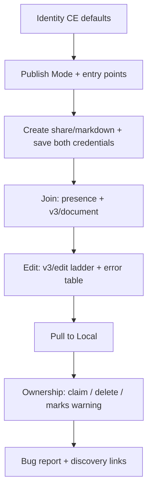

# fix: Migrate ce-proof to Proof v3 and owner credential lifecycle

## Goal Capsule

- **Objective:** Make `ce-proof` teach only Proof’s current web agent HTTP surface (`/v3/document`, `/v3/edit`) and the official `accessToken` / `ownerSecret` ownership model, while keeping compound-engineering’s publish-primary product shell (identity, one-way local-file publish, pull-to-local, upstream handoffs).
- **Authority:** Confirmed scope from this planning session; Proof’s hosted-agent docs in the local `EveryInc/proof` checkout as the API source of truth (not `proof-sdk`, which lags production). Issue [#876](https://github.com/EveryInc/compound-engineering-plugin/issues/876) supplies the ownerSecret orphan-doc symptom and cleanup gap.
- **Done when:** `skills/ce-proof/SKILL.md` and `docs/skills/ce-proof.md` contain no Local Bridge, `/ops`, `/edit/v2`, `/state`, `/snapshot`, or `baseToken` teaching; create workflow persists both credentials with distinct roles; delete/claim/revocation and “no comment delete” are documented; content-contract tests pin the new surface; unified-plan publish phrases still pass; `bun test` green; PR can close #876.

## Product Contract

### Summary

`ce-proof` currently documents an obsolete Proof agent API (state/ops/edit-v2 + `baseToken`) and an equal Local Bridge layer, while showing `ownerSecret` in a sample JSON without extracting or using it. Agents copy the create example, drop the only delete credential, and leave undeletable orphan docs (marks can survive emptied content). Proof’s official agent skill already documents v3 + credential roles. This plan rewrites the CE skill to that substrate under CE’s publish-primary shell, with no legacy appendix and no Bridge.

### Requirements

- R1. Document only the Proof web agent HTTP surface: create via `POST /share/markdown`, read via `GET /api/agent/<slug>/v3/document`, mutate via `POST /api/agent/<slug>/v3/edit` (optional `baseRevision`; no `baseToken`).
- R2. Remove Local Bridge (`localhost:9847` and all bridge endpoint tables) from the skill and catalog page; the skill is web-first only.
- R3. Remove teaching of `/api/agent/{slug}/state`, `/snapshot`, `/ops`, `/edit/v2`, `baseToken` / `mutationBase`, `STALE_BASE` / `BASE_TOKEN_REQUIRED`, and `rewrite.apply` + `LIVE_CLIENTS_PRESENT` as the whole-doc path.
- R4. Preserve CE product shell: identity `ai:compound-engineering` / display name `Compound Engineering`; Publish Mode (one-way from local markdown via `jq --rawfile`); HTML unified plans stay local; readiness-aware plan titles; direct + upstream entry points; Pull to Local as an explicit atomic sync.
- R5. On create, extract and retain for the session: `slug`, `accessToken`, `ownerSecret`, `shareUrl`/`tokenUrl`, and useful `_links`. Teach `accessToken` as everyday bearer and `ownerSecret` as owner-only (delete / owner ops) — never as the everyday bearer; store them separately.
- R6. Always hand humans the tokenized link (`tokenUrl`), never a bare `/d/<slug>` alone, so editor capability and claim capability remain available.
- R7. Document delete: `DELETE /api/documents/<slug>` authorized by `ownerSecret` (or Every owner session). Viewer/commenter/editor tokens cannot delete. Document `DOCUMENT_DELETE_FORBIDDEN` reasons and post-delete `shareState: "DELETED"` / later `410`.
- R8. Document ownership claim: public creates are ownerless until a signed-in Every user claims in the browser; claim permanently revokes `ownerSecret` while `accessToken` keeps working; after claim, owner-level ops belong to the owner (ask them / use their session) — do not retry delete with the revoked secret.
- R9. Do not auto-DELETE after every publish handoff (review docs must linger). Delete when the user asks to remove/clean up, or when finishing an explicitly ephemeral scratch doc the user is done with. Persist `ownerSecret` for the session so cleanup remains possible while unclaimed.
- R10. Warn that emptying markdown / `set_document` does not scrub comment marks; v3 supports resolve/unresolve but not comment delete; without owner delete authority, content wipe is not a privacy cleanup.
- R11. Re-teach edit ladder and retries in v3 terms: prefer narrow `replace`/`insert`/`delete`; use `suggest` when track-changes matter; `set_document` last (collab-safe per Proof). Retry against `error.current` / re-read on `202`/`PENDING`; never silent first-match on ambiguous targets.
- R12. Keep frontmatter discoverability (negative triggers for proofread/math/PoC) and model-invoked callee status. Omit MCP Mode as a first-class section (optional one-liner only if needed).
- R13. Update `docs/skills/ce-proof.md` and the Collaboration catalog row in lockstep; preserve unified-plan contract phrases agents and tests rely on (`Only publish markdown`, `requirements-only` title labeling).
- R14. Add regression tests so create/ownership/v3 guidance cannot regress to the old copy-paste gap.

### Scope Boundaries

**In scope**

- `skills/ce-proof/SKILL.md` full rewrite of the HTTP protocol chapters
- `docs/skills/ce-proof.md` + `docs/skills/README.md` Collaboration row wording
- Content-contract tests under `tests/` pinning v3 + owner lifecycle + absence of Bridge/legacy paths
- Closing #876 via the ownership sections of this rewrite

**Out of scope**

- Changing Proof product code or `proof-sdk`
- Adopting Proof’s `collaborative_docs` / `all_new_markdown` auto-create defaults
- Dual-documenting legacy HTTP or keeping a “legacy appendix”
- Local Bridge retention or demotion (full removal)
- MCP/OAuth as the primary CE install path
- Caller skill rewrites (`ce-plan` / `ce-brainstorm` / `ce-ideate` handoffs) unless a named CE workflow phrase disappears
- Stale-skill registry edits (name stays `ce-proof`)
- Skill-count bump in `tests/release-metadata.test.ts`

### Deferred to Follow-Up Work

- Optional skill-creator behavioral evals against live Proof (recommended after merge if manual smoke is thin)
- Refreshing Codex writer fixture URLs from `/state` to `/v3/document` for realism (not blocking; fixtures are URL-preservation tests, not skill SoT)

## Planning Contract

### Assumptions

- Hosted `proofeditor.ai` matches the local `EveryInc/proof` docs (`docs/proof.SKILL.md`, `docs/agent-docs.md`, `AGENT_CONTRACT.md`) more closely than `proof-sdk`.
- Upstream handoffs only need `ce-proof` to keep Publish Mode + identity + return-control; they do not embed legacy HTTP shapes.
- `.agy/skills/ce-proof` is not a second SoT (symlink/install entry); edit `skills/ce-proof/` only.

### Key Technical Decisions

- KTD1. **CE shell + Proof v3 core.** Rewrite protocol chapters from Proof’s official skill; do not paste `proof.SKILL.md` wholesale (would wipe CE identity, publish-primary defaults, pull-to-local, and frontmatter shape).
- KTD2. **Hard cutover.** No legacy appendix; grepping the skill for `/edit/v2`, `baseToken`, `Local Bridge`, `/ops` (agent ops path), and `/state` (agent state path) must find zero teaching hits after the rewrite.
- KTD3. **Ownership model from Proof, not #876’s “user creates first” default.** Agent create remains valid; capture both secrets; hand `tokenUrl`; teach claim/revocation; delete with `ownerSecret` while unclaimed.
- KTD4. **Lifecycle policy.** Persist `ownerSecret` for the session; delete on user request / ephemeral end — never as an automatic post-publish step that would destroy review URLs from chain handoffs.
- KTD5. **Pull-to-local reads v3.** Replace `/state` markdown extraction with `v3/document` (or content-negotiated markdown) while keeping atomic `jq -jr` + `mv` and confirm-before-side-effect-write.
- KTD6. **MCP omitted as a section.** At most one optional preference line if typed `proof_*` tools exist; HTTP/`Bash` remains the portable path.
- KTD7. **Catalog + skill + tests move together.** Treat docs-page drift as a ship blocker for this PR.
- KTD8. **Test strategy.** Mechanical content-contract assertions in `bun test`; live Proof smoke / skill-creator is recommended verification, not a substitute for the contract tests.

### High-Level Technical Design

Target skill shape (ordered chapters):



Credential lifecycle (must be taught explicitly):

```mermaid
sequenceDiagram
  participant Agent
  participant Proof
  participant Human
  Agent->>Proof: POST /share/markdown
  Proof-->>Agent: accessToken + ownerSecret + tokenUrl
  Agent->>Human: hand tokenUrl only
  Note over Agent: use accessToken for read/edit/presence
  alt Human claims ownership
    Human->>Proof: Claim in UI
    Proof-->>Agent: ownerSecret revoked; accessToken still works
    Note over Agent: delete only via owner / ask human
  else Still ownerless
    Agent->>Proof: DELETE with ownerSecret when user wants cleanup
  end
```

### Product Contract preservation

Product Contract written in this bootstrap (no upstream brainstorm). Confirmed user scope: v3-only HTTP, Proof ownership model, Bridge removed.

## Implementation Units

### U1. Rewrite `skills/ce-proof/SKILL.md` to v3 + ownership

**Goal:** Replace the obsolete HTTP + Bridge body with CE shell + Proof v3 protocol and ownership lifecycle.

**Requirements:** R1–R12

**Dependencies:** None

**Files:**
- Modify: `skills/ce-proof/SKILL.md`

**Approach:**
- Keep frontmatter name/`description` intent (negative triggers) and `allowed-tools`.
- Keep Identity, Publish Mode, Create-from-file (`jq --rawfile`), entry points, HTML/plan title rules.
- Replace all Web API edit/read/retry chapters with condensed v3 from Proof docs (visible-text ops, `comments[]`/`suggestions[]`, error envelope, optional `baseRevision`, Idempotency-Key for important writes).
- Expand create workflow extraction to include `OWNER_SECRET` with an inline “required for owner delete; not everyday bearer” note; always echo `tokenUrl`.
- Add Ownership section: roles, claim/revocation, DELETE examples, marks/privacy warning, when to delete vs leave for review.
- Rewrite Review / Create / Pull workflows’ curl samples to v3 only.
- Delete Local Bridge section entirely.
- Apply portable-authoring admission: falsifiable protocol over motivational prose; no dual-path insurance.

**Patterns to follow:**
- Proof `docs/proof.SKILL.md` + `docs/agent-docs.md` for API truth
- Existing CE Publish Mode / identity / pull-to-local patterns in current `skills/ce-proof/SKILL.md`
- `docs/solutions/skill-design/portable-agent-skill-authoring.md` and frontier-modernization (PROTOCOL fully prescribed; JUDGMENT compressed)

**Test scenarios:**
- Covered by U3 content contracts + Verification Contract smoke.
- Preserve strings required by `tests/skills/unified-plan-artifact-contract.test.ts`: `Only publish markdown` and `requirements-only`.

**Verification:** Skill grep-clean of legacy tokens; create sample extracts `ownerSecret`; delete + claim language present; Bridge absent; unified-plan test still passes after U3.

---

### U2. Rewrite catalog docs for web-first v3

**Goal:** Align human-facing skill docs with the rewritten skill; remove Bridge and legacy API teaching.

**Requirements:** R13

**Dependencies:** U1 (or write in the same PR after U1 content is settled)

**Files:**
- Modify: `docs/skills/ce-proof.md`
- Modify: `docs/skills/README.md` (Collaboration row)
- Optionally touch: `README.md` inventory blurb if purpose text should mention ownership/v3 (only if wording is now wrong)

**Approach:**
- Retell TL;DR / Novel / Reference / FAQ around one-read/one-write v3, credential roles, delete/claim, pull-to-local, publish-primary.
- Remove Local Bridge peer-layer language and `/ops` vs `/edit/v2` FAQ answers.
- Keep chain-position and standalone usage sections; update “when to skip” so network-only (no Bridge fallback).

**Patterns to follow:** Existing `docs/skills/ce-proof.md` structure; AGENTS.md plugin-doc sync convention.

**Test expectation:** none — prose catalog; U3 may optionally assert catalog row no longer says “Local Bridge”.

**Verification:** Catalog no longer advertises Bridge or `baseToken`; examples match skill curl shapes.

---

### U3. Content-contract regression tests

**Goal:** Prevent the create-example ownerSecret drop and legacy-surface regression.

**Requirements:** R14, R1–R3, R5–R8, R13 (testable slices)

**Dependencies:** U1 (and U2 if asserting catalog strings)

**Files:**
- Create or modify: a focused test under `tests/` (prefer extending an existing skill content test file if one fits; otherwise add e.g. `tests/skills/ce-proof-contract.test.ts`)
- Modify if needed: `tests/skills/unified-plan-artifact-contract.test.ts` (only if publish phrases move)

**Approach:**
- Assert `skills/ce-proof/SKILL.md` contains: `v3/document`, `v3/edit`, `ownerSecret` extraction guidance (e.g. `OWNER_SECRET` or explicit persist language), `DELETE` `/api/documents`, claim/revocation or “permanently revoked”, and `tokenUrl`.
- Assert absence of: `Local Bridge`, `localhost:9847`, `/edit/v2`, `baseToken`, agent `/ops` teaching path, agent `/state` teaching path, `rewrite.apply` as documented op.
- Keep unified-plan expectations green.
- Do not bump `skills: 30` in release-metadata.

**Patterns to follow:** `tests/skills/unified-plan-artifact-contract.test.ts` style of reading skill files as strings; skill-conventions listing for `ce-proof`.

**Test scenarios:**
- Happy path: skill file includes v3 endpoints and ownerSecret persist + DELETE guidance.
- Negative: skill file does not include Local Bridge / edit-v2 / baseToken teaching strings.
- Integration: unified-plan artifact contract still finds markdown-only + requirements-only labeling.
- Edge: description length and model-invoked callee conventions still pass via existing `skill-conventions` suite.

**Verification:** `bun test` for the new/updated files plus full suite before PR.

**Execution note:** Write the failing content assertions first, then land U1/U2 until green.

## Verification Contract

- `bun test` (full suite) after U1–U3
- Targeted: new `ce-proof` content-contract tests + `tests/skills/unified-plan-artifact-contract.test.ts` + `tests/skill-conventions.test.ts`
- Manual smoke (recommended): create a throwaway doc on `proofeditor.ai`, confirm response includes `ownerSecret`, read/edit via v3 with `accessToken`, DELETE with `ownerSecret`, confirm editor token cannot DELETE
- `bun run release:validate` if description inventory wording changes in ways that affect release metadata (skill count unchanged expected)

## Definition of Done

- U1–U3 complete and verification green
- No legacy HTTP or Local Bridge teaching remains in skill or catalog page
- #876 addressable by this change set (`Fixes #876` in the PR)
- Callers unchanged unless a broken named workflow phrase forces a minimal text tweak
- No hand-bumped plugin versions or changelog entries

## Risks & Dependencies

| Risk | Mitigation |
|------|------------|
| Proof docs drift from hosted production | Prefer local Proof repo docs; smoke against `proofeditor.ai`; note proof-sdk lag if consulted |
| Agents still invent `/ops` from memory | Hard cutover + negative tests; short explicit “use v3 only” line near edit section |
| Auto-delete destroys review handoffs | KTD4 / R9: delete is user-driven, not post-publish automatic |
| Claim revokes secret mid-session | Teach revocation; after claim, stop using `ownerSecret` for delete |
| Catalog/skill drift | U2 mandatory in same PR; optional catalog string assert in U3 |
| Naive paste of Proof skill | KTD1; preserve CE shell checklist in U1 verification |

## Sources & Research

- Issue [#876](https://github.com/EveryInc/compound-engineering-plugin/issues/876)
- Local Proof: `docs/proof.SKILL.md`, `docs/agent-docs.md`, `AGENT_CONTRACT.md` (create/delete/claim/v3)
- Current CE: `skills/ce-proof/SKILL.md`, `docs/skills/ce-proof.md`
- Learnings: `docs/solutions/skill-design/portable-agent-skill-authoring.md`, `frontier-model-skill-modernization-methodology.md`, `bundled-script-path-resolution-across-harnesses.md` (agents copy fenced examples), `integrations/opencode-temperature-rejected-by-sonnet5-opus48.md` (API bumps need full consumer audit)
- Confirmed scoping: v3-only HTTP; Proof ownership model; Bridge removed; no legacy appendix
